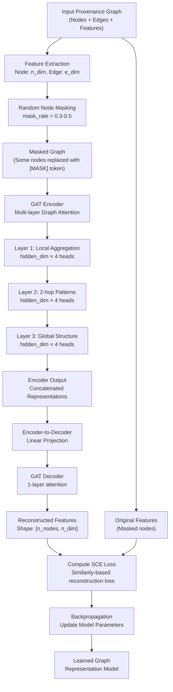
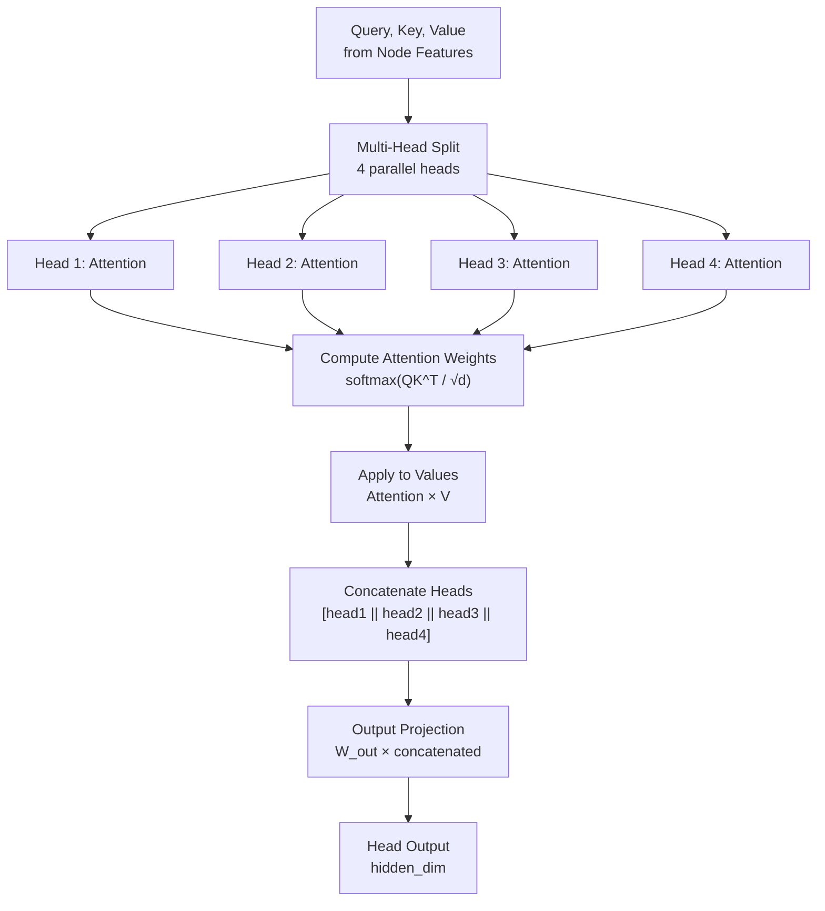
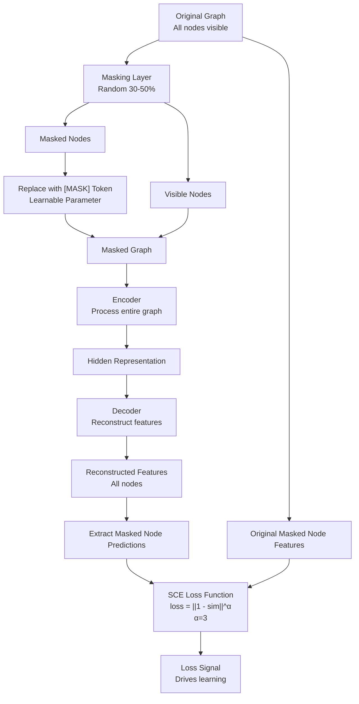
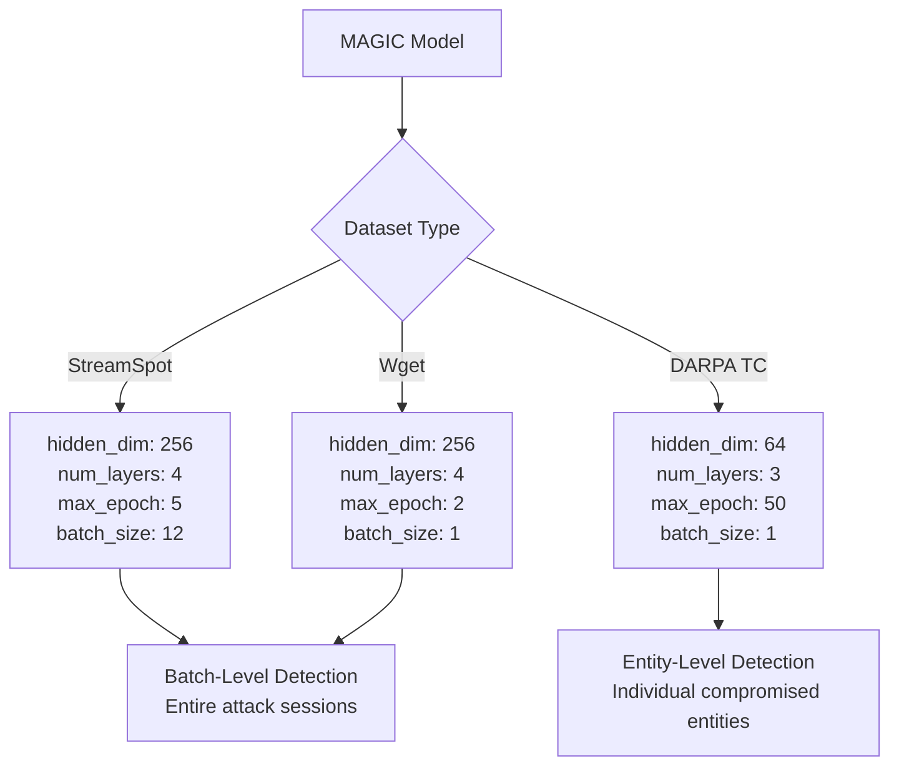
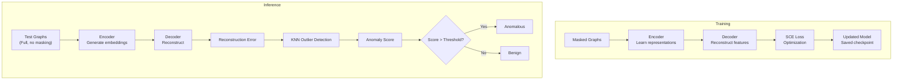
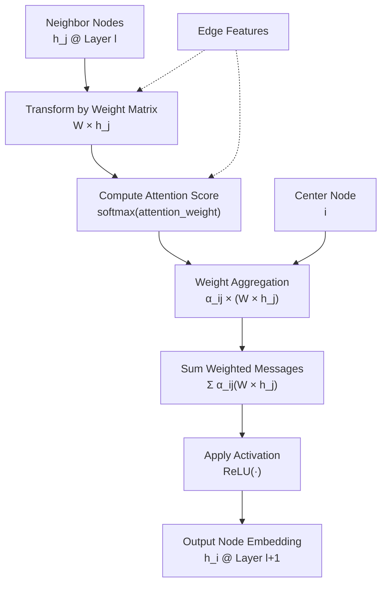
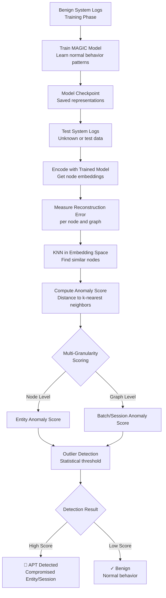
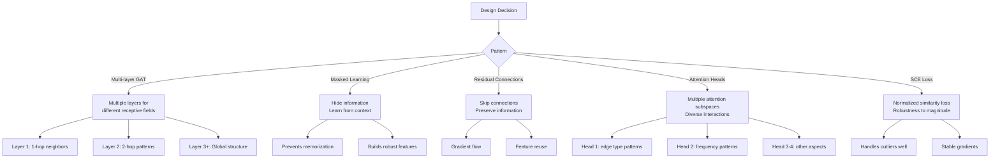

# MAGIC Architecture Visualization

## Complete Pipeline Architecture

## Encoder Architecture (GAT Stack)

```mermaid
graph LR
    A["Input Features<br/>n_dim"] --> B["GATConv Layer 1<br/>4 heads<br/>→ hidden_dim"]
    B --> C["Attention Aggregation<br/>Multi-head"]
    C --> D["BatchNorm + PReLU"]
    D --> E["Residual Connection"]
    E --> F["GATConv Layer 2<br/>4 heads<br/>→ hidden_dim"]
    F --> G["Attention Aggregation<br/>Multi-head"]
    G --> H["BatchNorm + PReLU"]
    H --> I["Residual Connection"]
    I --> J["GATConv Layer 3<br/>4 heads<br/>→ hidden_dim"]
    J --> K["Attention Aggregation<br/>Multi-head"]
    K --> L["Output Embeddings<br/>hidden_dim × 4"]
    L --> M["Concatenate All Layers<br/>hidden_dim × num_layers"]
```

## Attention Head Mechanism

## Masking & Reconstruction Loss

## Dataset-Specific Configurations

## Training vs Inference

## Message Passing in GATConv

## Anomaly Detection Pipeline

## Feature Flow Through Model

```mermaid
graph LR
    A["Node Features<br/>Dimension: n_dim"] --> B["GAT Layer 1<br/>linear: n_dim → hidden_dim/4<br/>attention: 4 heads"]
    B --> C["hidden_dim<br/>4 heads"]
    C --> D["Concat heads<br/>→ hidden_dim"]
    D --> E["GAT Layer 2<br/>linear: hidden_dim → hidden_dim/4<br/>attention: 4 heads"]
    E --> F["hidden_dim<br/>4 heads"]
    F --> G["Concat heads<br/>→ hidden_dim"]
    G --> H["GAT Layer 3<br/>linear: hidden_dim → hidden_dim/4<br/>attention: 4 heads"]
    H --> I["hidden_dim<br/>4 heads"]
    I --> J["Concat: All Layers<br/>hidden_dim × num_layers"]
    J --> K["Decoder Projection<br/>linear: hidden_dim×num_layers → hidden_dim"]
    K --> L["Decoder Layer<br/>hidden_dim → n_dim"]
    L --> M["Reconstructed Features<br/>Dimension: n_dim"]
```

## Key Design Patterns

