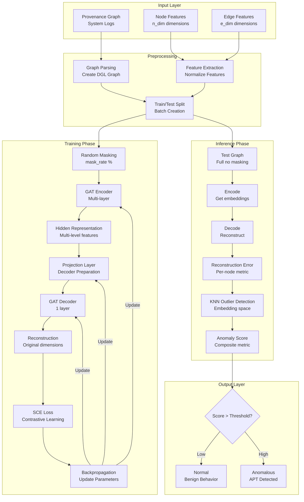
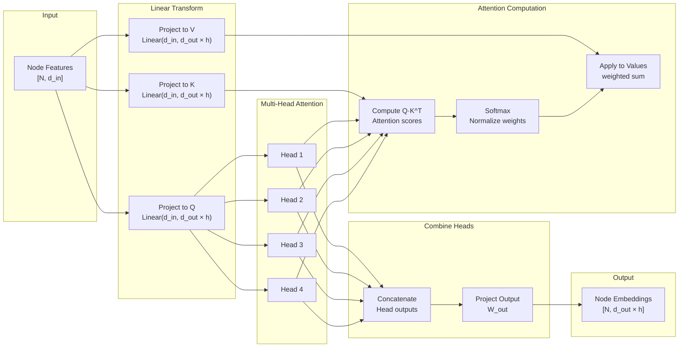
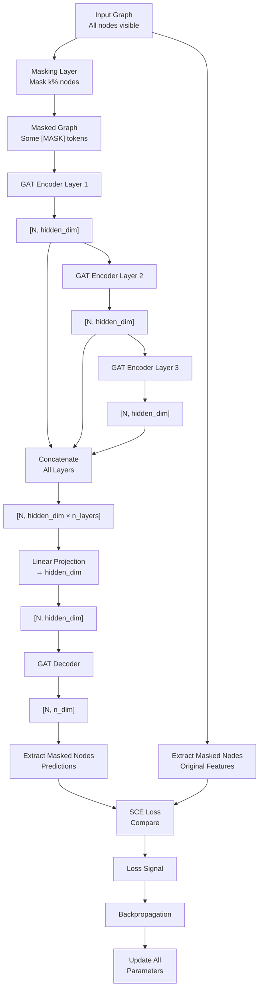
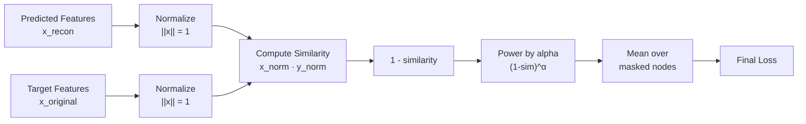
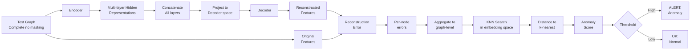

# MAGIC: Complete System Architecture Diagram

## 1. Full Pipeline: From Raw Data to Anomaly Detection



---

## 2. Graph Attention Network (GAT) Layer Details



---

## 3. Masked Autoencoder Architecture



---

## 4. Loss Function: SCE (Symmetric Cross Entropy)



---

## 5. Complete Layer-by-Layer Feature Dimensions

### StreamSpot Example (num_layers=4, num_heads=4, hidden_dim=256)

```
INPUT: Provenance Graph
├─ Nodes: 100-500
├─ Node Features: [N, 15]
├─ Edge Features: [E, 2]
└─ Edges: 200-2000

MASKING (30%)
├─ Mask Tokens: Create [1, 15] learnable parameter
├─ Replace 30 nodes with [MASK] token
└─ Result: Modified graph for encoder

GAT ENCODER - LAYER 1
├─ Input: [N, 15]
├─ Linear projections: 15 → 64×4 (4 heads)
├─ Per-head computations: [N, 64] per head
├─ Output attention: softmax over edges
├─ Value aggregation: [N, 64] per head
├─ Concatenate heads: [N, 256]
└─ Output: [N, 256]

GAT ENCODER - LAYER 2
├─ Input: [N, 256]
├─ Linear projections: 256 → 64×4
├─ Multi-head attention: same mechanism
└─ Output: [N, 256]

GAT ENCODER - LAYER 3
├─ Input: [N, 256]
├─ Linear projections: 256 → 64×4
├─ Multi-head attention: same mechanism
└─ Output: [N, 256]

GAT ENCODER - LAYER 4
├─ Input: [N, 256]
├─ Linear projections: 256 → 64×4
├─ Multi-head attention: same mechanism
└─ Output: [N, 256]

CONCATENATE ENCODER LAYERS
├─ Cat([Layer1, Layer2, Layer3, Layer4])
├─ [N, 256] || [N, 256] || [N, 256] || [N, 256]
└─ Output: [N, 1024]

ENCODER-TO-DECODER PROJECTION
├─ Linear(1024, 256)
└─ Output: [N, 256]

GAT DECODER - LAYER 1
├─ Input: [N, 256]
├─ Linear projections: 256 → hidden_dim
├─ Attention computation (1 layer)
├─ Output projection: → 15
└─ Output: [N, 15]

LOSS COMPUTATION
├─ Extract predictions[masked_indices]: [M, 15]
├─ Extract targets[masked_indices]: [M, 15]
├─ SCE Loss: normalize & compute (1-sim)^3
└─ Final Loss: scalar value
```

---

## 6. Training Loop State Machine

```mermaid
stateDiagram-v2
    [*] --> Initialize
    
    Initialize --> LoadData
    LoadData --> BuildModel
    
    BuildModel --> EpochStart
    
    EpochStart --> BatchLoop
    
    BatchLoop --> MaskNodes: For each batch
    MaskNodes --> Encode: Forward pass
    Encode --> Concat: Combine layers
    Concat --> Project: Linear projection
    Project --> Decode: Decoder forward
    Decode --> ComputeLoss: Compare predictions
    ComputeLoss --> Backward: Backpropagation
    Backward --> UpdateParams: Optimizer step
    
    UpdateParams --> BatchComplete{More batches?}
    BatchComplete -->|Yes| BatchLoop
    BatchComplete -->|No| EpochComplete
    
    EpochComplete --> CheckConvergence{Converged?}
    CheckConvergence -->|No| EpochStart
    CheckConvergence -->|Yes| SaveModel
    
    SaveModel --> [*]
```

---

## 7. Inference Pipeline



---

## 8. Dataset Configuration Matrix

```
┌──────────────┬─────────┬─────────┬──────────┬────────────┬──────────┐
│ Dataset      │ n_dim   │ e_dim   │ n_layers │ hidden_dim │ batch_sz │
├──────────────┼─────────┼─────────┼──────────┼────────────┼──────────┤
│ StreamSpot   │ 15      │ 2       │ 4        │ 256        │ 12       │
│ Wget         │ 12      │ 2       │ 4        │ 256        │ 1        │
│ Trace        │ 40      │ 5       │ 3        │ 64         │ 1        │
│ Theia        │ 40      │ 5       │ 3        │ 64         │ 1        │
│ Cadets       │ 40      │ 5       │ 3        │ 64         │ 1        │
└──────────────┴─────────┴─────────┴──────────┴────────────┴──────────┘
```

---

## 9. Model Parameter Count Estimation

```
For StreamSpot Configuration:
  n_dim=15, e_dim=2, hidden_dim=256, n_layers=4, n_heads=4

GAT Encoder (each layer):
  ├─ Q projection: 256 × 256 + 256 = 65,792
  ├─ K projection: 256 × 256 + 256 = 65,792
  ├─ V projection: 256 × 256 + 256 = 65,792
  ├─ Edge projection: 2 × 4 + 4 = 12
  ├─ Attention params: 1 × 4 × 64 = 256
  └─ Output projection: (256×4) × (256×4) = 1,048,576

Per GAT layer: ~1.25M parameters
Encoder (4 layers): ~5M parameters

GAT Decoder (1 layer):
  ├─ Q, K, V projections: ~66K each = 198K
  ├─ Output projection: 256×256 + bias = 65,792
  └─ Total: ~265K parameters

Encoder-to-Decoder: 1024 × 256 = 262,144 parameters
Mask token: 1 × 15 = 15 parameters

Total: ~5.5M parameters
```

---

## 10. Computational Complexity Analysis

```
For a graph with N nodes and E edges:

Forward Pass:
├─ Per GAT layer: O(E + N)
│  ├─ Linear transforms: O(N × d)
│  ├─ Attention: O(E + N log N) with softmax
│  └─ Aggregation: O(E)
├─ All encoder layers: O(num_layers × (E + N))
├─ Decoder layer: O(E + N)
└─ Total: O(num_layers × E)

Memory Usage:
├─ Node features: O(N × hidden_dim)
├─ All layer outputs: O(N × hidden_dim × num_layers)
├─ Attention weights: O(E)
└─ Total: O(N × hidden_dim × num_layers)

For StreamSpot: N~500, E~2000, hidden_dim=256
├─ Forward: ~24K operations
├─ Memory: ~512KB activations
└─ GPU memory: ~10GB for batch of 12 graphs
```

---

## 11. Anomaly Detection Decision Boundary

```
Reconstruction Error Threshold Determination:

1. Train on Benign Data
   ├─ Compute reconstruction errors
   ├─ Distribution: typically log-normal or exponential
   └─ Mean ≈ 0.1-0.5 depending on dataset

2. Analyze Error Distribution
   ├─ Normal data: low errors (μ ≈ 0.2, σ ≈ 0.1)
   ├─ Anomalous data: high errors (μ ≈ 0.8, σ ≈ 0.3)
   └─ Overlap region: 0.4-0.6

3. Set Detection Threshold
   ├─ Option 1: μ_normal + 3σ (99.7% detection)
   ├─ Option 2: ROC curve knee point (maximize TPR-FPR)
   └─ Option 3: Percentile cutoff (e.g., 95th percentile)

4. Multi-Granularity Scoring
   ├─ Node-level: individual node errors
   ├─ Edge-level: edge reconstruction (optional)
   └─ Graph-level: mean/max/weighted aggregate
```

---

## 12. Key Formulas Reference

### Attention Mechanism
$$\text{Attention}(Q,K,V) = \text{softmax}\left(\frac{Q \cdot K^T}{\sqrt{d_k}}\right) \cdot V$$

### Multi-head Attention
$$\text{MultiHead}(Q,K,V) = \text{Concat}(\text{head}_1,...,\text{head}_h) \cdot W^O$$
where $\text{head}_i = \text{Attention}(Q W_i^Q, K W_i^K, V W_i^V)$

### SCE Loss
$$\mathcal{L}_{SCE} = \text{mean}\left[(1 - \cos(x, y))^{\alpha}\right]$$
where $\cos(x,y) = \frac{x \cdot y}{||x|| \cdot ||y||}$

### Node Embedding Update (GAT)
$$h_i^{(l+1)} = \sigma\left(\sum_{j \in \mathcal{N}(i) \cup \{i\}} \alpha_{ij}^{(l)} W^{(l)} h_j^{(l)}\right)$$

### Reconstruction Error
$$E = \frac{1}{N} \sum_{i=1}^{N} ||x_i^{\text{recon}} - x_i^{\text{orig}}||_2$$

### KNN Anomaly Score
$$A_i = \frac{1}{k} \sum_{j \in kNN(i)} ||e_i - e_j||_2$$

---

## 13. Debugging Decision Tree

```
                    Training Not Converging?
                           |
                  _____ ___|___ _____
                 |              |
            Loss oscillates   Loss stuck
                 |              |
              Check:         Check:
            • Learning      • Learning
              rate          rate too small
            • Batch size    • Data quality
            • Gradients     • Model capacity
                 |              |
            Reduce LR       Increase LR
            or add LR       or add 
            scheduling      regularization
```

---

## Summary Table: Model Component Roles

| Component | Input | Output | Purpose |
|-----------|-------|--------|---------|
| Masking Layer | Graph | Masked Graph | Create self-supervised task |
| GAT Encoder L1 | [N, n_dim] | [N, h] | Local feature learning |
| GAT Encoder L2 | [N, h] | [N, h] | 2-hop patterns |
| GAT Encoder L3 | [N, h] | [N, h] | Global structure |
| Concatenation | 3×[N, h] | [N, 3h] | Multi-level features |
| Encoder-to-Decoder | [N, 3h] | [N, h] | Dimensionality match |
| GAT Decoder | [N, h] | [N, n_dim] | Feature reconstruction |
| SCE Loss | [M, n_dim] pairs | scalar | Training signal |

MAGIC processes provenance graphs through a sequence of learned transformations that balance depth (multiple layers), breadth (multi-head attention), and interpretability (attention weights).
